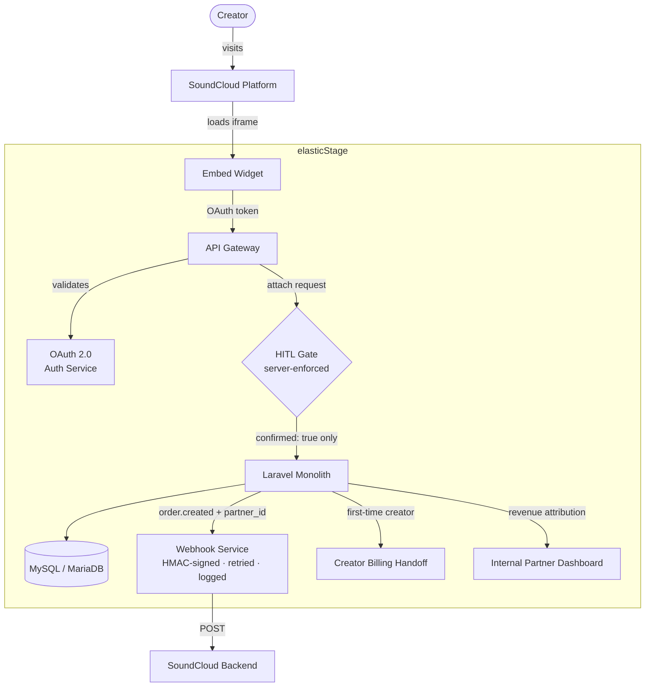
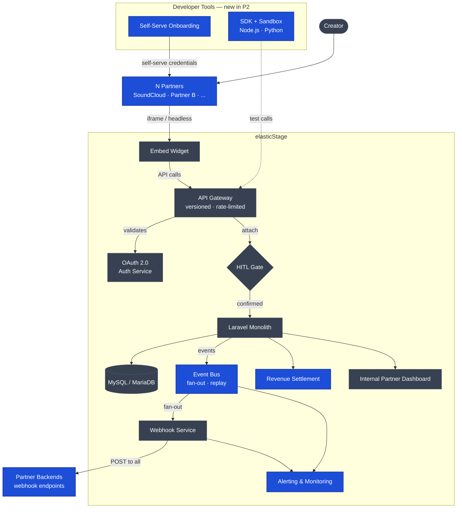

# elasticStage Partner Portal — Prototype

**Part b submission** for the elasticStage Platform & AI take-home task.

**Live demo:** https://elasticstage-partner-portal.vercel.app

---

## What I built

A developer-facing partner portal demonstrating how a music platform (SoundCloud) integrates with elasticStage's public API to embed vinyl/CD release creation inside their own product.

**Priority chosen:** Public API + Developer Portal — the foundational layer that makes every partnership integration self-serve and non-linear to scale.

**Strategic framing:** Partner #10 should cost as much to onboard as partner #2. Today's point-to-point integrations (SoundCloud, Amuse) don't scale. This portal is the structural fix — a stable, versioned API contract that any partner can integrate against without talking to a sales rep.

---

## Screens

| Screen | Route | Purpose |
|---|---|---|
| Developer Console | `/` | API key, dual auth model, quickstart snippet |
| API Playground | `/playground` | 8 interactive Release endpoints, mock responses, code snippets |
| Widget Preview | `/widget-preview` | Live embed in mock artist page, theme customiser, iframe snippet |
| Partner Dashboard | `/dashboard` | Revenue reporting, active releases, webhook config |
| API Reference | `/api-reference` | Auth model, SDK install, endpoint table, error codes, webhook events |
| Embed Widget | `/embed` | 5-step release creation flow; HITL gate on irreversible attach step |

---

## Key product decisions

Full rationale in [DECISIONS.md](./DECISIONS.md). Summary:

- **SoundCloud as the named partner** — existing elasticStage relationship; using a real partner makes the demo concrete rather than hypothetical. DistroKid and Amuse are valid alternatives but less proven.
- **Dual auth model** — API key for testing (shown on Screen 1), OAuth 2.0 client credentials for production server-to-server calls. API keys are static and unsafe for production; OAuth tokens expire and rotate automatically.
- **HITL gate on attach** — `POST /releases/{id}/attach` is flagged as irreversible throughout. The embed widget requires an explicit creator confirmation checkbox before the publish button activates. The API should also enforce `confirmed: true` server-side in production.
- **Full API surface visible, not all interactive** — Release Lifecycle endpoints (9) are fully interactive. Auth, Creators, Orders, and Webhooks groups are visible but greyed-out, signalling product maturity without over-building the prototype.
- **Stripe-pattern code snippets** — each endpoint shows a live-updating code snippet in Node.js / cURL / Python using a fictional `@elasticstage/sdk`. A developer can go from API key to working code in under 5 minutes.
- **Widget theming via URL parameters** — the embed reads `?partner=soundcloud&color=%23FF5500` and applies the brand colour as a CSS variable. The theme customiser on Screen 3 updates the iframe src in real-time.
- **Post-publish mutability** — `attach` locks physical product attributes permanently (format, tracks, EAN). Commercial metadata (release_date, price_tier, territory, description) remains editable via a separate `PATCH /releases/{id}` endpoint, avoiding a dedicated endpoint causes field-level confusion.
- **Three integration modes** — iframe embed (web, zero effort), headless API (full UI control), mobile SDK (future). The REST API is the common foundation; iframe is one presentation layer, not the only path.
- *(Excluded)* **AI conversational flow** — the agentic demo is a separate priority. The "same API serves both form and LLM" point is made verbally in the walkthrough.
- *(Excluded)* **Payment endpoints** — payment is between creator and elasticStage directly; the partner never handles it. Revenue share is tracked via `partner_id` and shown in the dashboard.

---

## Architecture

### P1 — One partner live, commercial blockers closed
Real OAuth, server-enforced HITL gate, direct webhook to SoundCloud, creator billing handoff.



### P2 — Multiple partners, self-serve, event bus
Blue = new in P2. Grey = carried from P1.



**Build vs buy:** Auth (managed OAuth), API gateway (off-the-shelf). Embed UI and attribution logic are built — these are the differentiated surfaces.

---

## How to run locally

**Requirements:** Node.js ≥ 18

```bash
# Install dependencies
npm install

# Start development server
npm run dev
```

Open http://localhost:3000

No environment variables required — all data is mocked.

---

## Tech stack

- **Next.js 16** (App Router) + TypeScript
- **Tailwind CSS** for styling
- **lucide-react** for icons
- **Vercel** for deployment
- All API responses are hardcoded mock data — no real backend

---

## What I would cut, build next, and test first

**Cut first (in order):**
1. **Partner Dashboard (Screen 4)** — revenue reporting doesn't validate the core DX question. Screens 2 and 3 carry the story.
2. **Python/cURL code snippets** — keep Node.js only if pressed for time.
3. **Live theme customiser** — replace with a static SoundCloud-branded widget; the colour picker is a nice-to-have.
4. **Widget Preview page (Screen 3)** — the mock SoundCloud iframe is a visual demo, not a technical one. The API Playground already demonstrates the headless integration path, which is the real DX story. Keep headless, cut the iframe preview.
5. **Mobile SDK integration** — iframe covers the majority of web partners. Mobile SDK adds significant build complexity for limited demo value; the headless API model covers any stack in the interim.

**Build next — P1 (commercial blockers, in dependency order):**

1. **Real OAuth 2.0 flow** — nothing goes to production without real partner identity. Every item below depends on it.
2. **Server-side HITL enforcement** — `confirmed: true` on attach must be validated and audited server-side before any real commercial action.
3. **`partner_id` attribution + webhook trigger** — stamp every order with the originating partner, fire a direct `order.created` webhook to SoundCloud. Minimum viable attribution without a full event bus.
4. **Real webhook delivery** — HMAC-signed, retried, logged. Turns a partner from "experimenting" to "committed".
5. **Creator billing handoff** — when a creator first uses the embed, they need a billing relationship with elasticStage. Currently unmodelled; this is the conversion moment.

P2 adds sandbox, SDK publishing, self-serve onboarding, formal event model, alerting/monitoring, and revenue settlement. P3 (polish) and full dependency ordering in [DECISIONS.md → Section 7](./DECISIONS.md).

**Test first:** Embed take-rate on SoundCloud — do creators actually click through and complete a release? Modelled at ~5% activation. Validate with a lightweight embed on one existing partner page before building the full self-serve portal.
